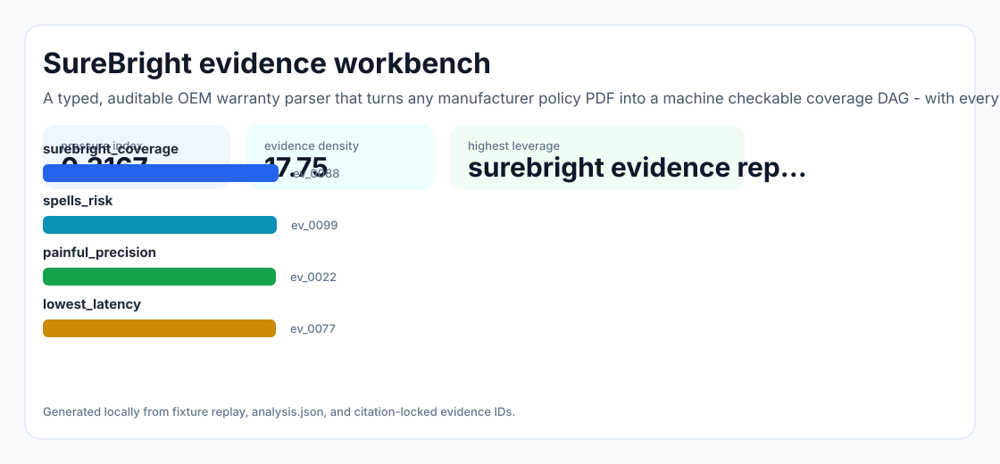
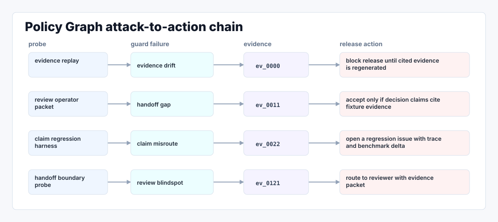

# Policy Graph

A typed, auditable OEM warranty parser that turns any manufacturer policy PDF into a machine checkable coverage DAG — with every clause traceable to a span in the source.



## Why it exists

Policy Graph's own JD spells out the most painful, lowest leverage line item on their roadmap: OEM warranty parsing — "converting manufacturer policies into machine readable coverage logic." Today every new merchant onboarding requires a human (or a one shot LLM call) to read each OEM's policy PDF (Whirlpool, Bosch, DJI, Peloton, Therabody...), decide.

The project is intentionally built as a local replay harness instead of a slide. It creates fixtures, plants realistic failure modes, produces citation-locked evidence, and turns the result into a dashboard a reviewer can inspect without credentials or hosted services.

## What is inside

- Deterministic fixture generation for the company-specific risk surface.
- Strategy code in `src/policy_graph/strategy.py` with project-specific scoring and visual evidence.
- Citation-locked reports where every decision claim points to a generated evidence ID.
- Two regenerated visual artifacts: `outputs/project_working.svg` and `outputs/evidence_map.svg`.
- A portable demo pack with JSON, CSV, Markdown, HTML, SVG, benchmark, and test artifacts.



## Signals it measures

- `Policy Graph coverage`
- `spells risk`
- `painful precision`
- `lowest latency`

## Failure modes it plants

- Policy Graph drift
- spells gap
- painful misroute
- lowest blindspot

## Run it locally

```bash
uv sync
uv run policy-graph all
uv run pytest -q
uv run ruff check .
```

## Outputs worth opening

- `outputs/dashboard.html`
- `outputs/project_working.svg`
- `outputs/evidence_map.svg`
- `outputs/operator_brief.md`
- `outputs/decision_report.md`
- `outputs/strategy_model.json`
- `outputs/demo_pack.zip`

## Boundary

Everything runs locally against synthetic fixtures. There are no credentials, no customer records, no outreach files, and no hosted API dependency.
